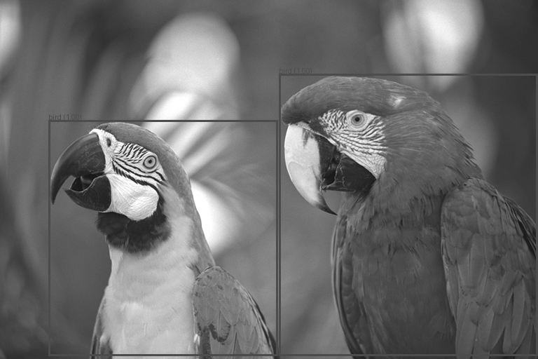

# Appendix

*Supporting material relocated from the main body and the Foundations section; none of it counts toward the page limit. Where the raw logs are long, the complete file is linked and a representative excerpt is shown inline.*

## A. Mini-project — full per-cell results (Tier 2 & Tier 3)

**Zero-shot baseline** (Mistral-7B-Instruct-v0.3, no adapter): likelihood 0.8235, broad-genmatch 0.8202. All cells below are evaluated on the full BoolQ dev set (3,270 examples).

**Tier 2 — per cell** (mean ± std over seeds $\{42, 1, 2\}$; BoolQ 500 steps, cs170k 2,500 steps):

| Train | Method | r | Likelihood | Genmatch (broad) | Genmatch (strict) | Runtime (s) | Peak mem (GB) |
|---|---|--:|--:|--:|--:|--:|--:|
| BoolQ | DoRA | 4 | 0.8742 ± 0.0067 | 0.8927 ± 0.0011 | — | 1189 | 59.4 |
| BoolQ | DoRA | 8 | 0.8797 ± 0.0079 | 0.8967 ± 0.0026 | — | 1181 | 59.6 |
| BoolQ | DoRA | 16 | 0.8811 ± 0.0081 | 0.8991 ± 0.0008 | — | 1181 | 59.9 |
| BoolQ | LoRA | 4 | 0.8780 ± 0.0040 | 0.8939 ± 0.0021 | — | 361 | 33.3 |
| BoolQ | LoRA | 8 | 0.8803 ± 0.0106 | 0.8987 ± 0.0036 | — | 361 | 33.5 |
| BoolQ | LoRA | 16 | 0.8792 ± 0.0043 | 0.8996 ± 0.0026 | — | 356 | 33.9 |
| cs170k | DoRA | 4 | 0.7499 ± 0.0851 | 0.8499 ± 0.0055 | 0.0980 ± 0.0792 | 5474 | 59.4 |
| cs170k | DoRA | 8 | 0.8140 ± 0.0244 | 0.8403 ± 0.0144 | 0.3183 ± 0.1952 | 5429 | 59.6 |
| cs170k | DoRA | 16 | 0.7294 ± 0.0903 | 0.7844 ± 0.0135 | 0.6296 ± 0.2627 | 5426 | 59.9 |
| cs170k | LoRA | 4 | 0.7788 ± 0.0723 | 0.8485 ± 0.0025 | 0.1069 ± 0.1657 | 1653 | 33.3 |
| cs170k | LoRA | 8 | 0.8103 ± 0.0131 | 0.8377 ± 0.0009 | 0.2624 ± 0.3501 | 1611 | 33.5 |
| cs170k | LoRA | 16 | 0.7835 ± 0.0131 | 0.8159 ± 0.0189 | 0.5742 ± 0.2282 | 1603 | 33.9 |

**Tier 2 — DoRA − LoRA gaps** (positive = DoRA higher):

| Regime · metric | r=4 | r=8 | r=16 |
|---|--:|--:|--:|
| BoolQ · likelihood | −0.0038 | −0.0006 | +0.0019 |
| BoolQ · genmatch (broad) | −0.0012 | −0.0019 | −0.0005 |
| cs170k · likelihood | −0.0288 | +0.0037 | −0.0541 |
| cs170k · genmatch (broad) | +0.0014 | +0.0025 | −0.0315 |
| cs170k · genmatch (strict) | −0.0089 | +0.0559 | +0.0555 |

**Tier 3 — per cell** (mean ± std over seeds $\{114, 514, 1919, 810\}$; cs170k, 10,000 steps):

| Train | Method | r | Likelihood | Genmatch (broad) | Runtime (s) | Peak mem (GB) |
|---|---|--:|--:|--:|--:|--:|
| cs170k | DoRA | 4 | 0.6514 ± 0.2044 | 0.8272 ± 0.0071 | 19324 | 59.4 |
| cs170k | DoRA | 8 | 0.6180 ± 0.0530 | 0.8078 ± 0.0075 | 19134 | 59.6 |
| cs170k | DoRA | 16 | 0.4411 ± 0.1191 | 0.6645 ± 0.0565 | 19110 | 59.9 |
| cs170k | LoRA | 4 | 0.7644 ± 0.0856 | 0.8427 ± 0.0148 | 5957 | 33.3 |
| cs170k | LoRA | 8 | 0.4624 ± 0.1280 | 0.8000 ± 0.0114 | 5906 | 33.5 |
| cs170k | LoRA | 16 | 0.3817 ± 0.0069 | 0.7029 ± 0.0526 | 5880 | 33.9 |

**Tier 3 — DoRA − LoRA gaps:** likelihood +0.1557 at r=8 (−0.1131 at r=4, +0.0593 at r=16); broad-genmatch within ±0.04 at every rank (−0.0155 / +0.0078 / −0.0384).

**Cross-tier (Tier 3 − Tier 2) deltas, cs170k:** likelihood collapses (LoRA −0.014 / −0.348 / −0.402 at r=4/8/16; DoRA −0.099 / −0.196 / −0.288), while broad genmatch holds far better (LoRA −0.006 / −0.038 / −0.113; DoRA −0.023 / −0.033 / −0.120) — the format takeover, not a task collapse.

## B. Mini-project — representative raw generations (format adaptation)

Inspecting 20 generations per run with `evaluate.py --debug-print` resolved the parser puzzle:

| Run | r | Model emits | Strict | Broad |
|---|--:|---|--:|--:|
| `lora_r4_s1` | 4 | "the correct answer is **yes/no**" | 0.0003 | 0.846 |
| `dora_r16_s1` | 16 | "the correct answer is **true/false**" | 0.793 | 0.799 |

Low-rank adapters answer in the prompt's *yes/no* (so the strict true/false parser scores $\approx 0$ despite correct answers); high-rank adapters override the prompt with the trained *true/false*. Both are answering correctly — the difference is surface form, which is exactly what the broad-vs-strict split separates.

## C. Part 3b — full sentiment predictions (ten tricky reviews)

Greedy decoding; raw CSV at [`../Results-ipynb/sentiment_results.csv`](../Results-ipynb/sentiment_results.csv).

| # | Review (abridged) | Expected | Zero-shot | Few-shot | Note |
|--:|---|---|---|---|---|
| 1 | "…worried it would be terrible, but it actually wasn't bad…" | Positive | Positive | Positive | both correct |
| 2 | "Oh great, another 'groundbreaking' superhero movie…" | Negative | Negative | Negative | sarcasm caught |
| 3 | "The plot was non-existent… yet I couldn't look away." | Positive | Negative | Negative | both wrong (surface negativity) |
| 4 | "…not that the food was cold… wasn't particularly warm either." | Negative | Neutral | Neutral | instruction violated — hedged |
| 5 | "If you enjoy watching paint dry, you'll love this movie!" | Negative | Negative | Negative | sarcasm caught |
| 6 | "I've had better, but I've certainly had much, much worse." | Positive | Neutral | Neutral | instruction violated — ambiguous |
| 7 | "Everything about this place is perfect, except for the service, the food, and the price." | Negative | Negative | Negative | backhanded |
| 8 | "I can't believe how much I didn't hate this." | Positive | Negative | **Positive** | few-shot fixes double negation |
| 9 | "This is the best example of a terrible movie I have ever seen." | Negative | Negative | Negative | backhanded |
| 10 | "The only thing more disappointing than the ending was paying for the ticket." | Negative | Negative | Negative | both correct |

**Scoreboard vs the human label:** zero-shot 6/10, few-shot 7/10 (rows 4 and 6 hedge to Neutral in both).

## D. Part 3a — generation transcripts (the "LLM" sense-ambiguity)

Complete five-run logs for both models at [`../Results-ipynb/Part-3a.md`](../Results-ipynb/Part-3a.md). Opening lines, showing the sense each model assigns to "LLM":

**Mistral-7B-Instruct (prompt: "Outline an introduction to LLM…"):**

- Run 1 (T=0.7): "…Introduction to **Master of Laws (LLM)** Program…" — law degree (wrong sense)
- Run 2 (T=0.7): "…Bridging the Gap between Mathematics, Programming, and Artificial Intelligence" — AI-adjacent, never names *Large Language Models*
- Run 3 (T=0.1): "…Introduction to **Master of Laws (LLM)**…" — greedy, confidently wrong
- Run 4 (T=1.3): "…**Language Modeling Master's Program**…" — creative compromise
- Run 5 (specific prompt "**Large Language Models**", T=0.2): "…Introduction to **Large Language Models**: A Comprehensive Overview…" — correct

**Phi-3.5-mini** read it as *Large Language Models* in all five runs even with the original ambiguous prompt (e.g. Run 1: "Introduction to **Large Language Models (LLMs)** for Students with Math and Programming Backgrounds").

## E. Part 4.3.3 — 16-bit vs 4-bit A/B generations (greedy)

Complete transcripts at [`../Results-ipynb/Part-4.3.3.md`](../Results-ipynb/Part-4.3.3.md). Summary of the four probes:

| Prompt | 16-bit | 4-bit | Verdict |
|---|---|---|---|
| Sarcasm ("paint dry") | correct, fluent | correct, fluent | both pass, same explanation |
| Train word-problem | meet at **14:28** | meet at **14:27** | both pass; 4-bit rounds more precisely |
| *The Master and Margarita* | "in the **1940s**" | "in the **1940s**" | both **wrong**, identical (shared prior, not quantization) |
| `is_palindrome` | correct 3-line fn | identical 3-line fn | both pass, byte-identical code |

## F. Part 5.3 — QLoRA training-loss trajectory

100 optimizer steps (= 4 epochs over 100 IMDB reviews), logged every 5 steps:

2.76, 2.70, 2.52, 2.47, 2.63, 2.38, 2.33, 2.34, 2.30, 2.36, 2.13, 2.22, 2.18, 2.03, 2.18, 2.12, 1.93, 1.98, 1.92, 2.02 — final mean training loss **2.27**.

The step-5 `grad_norm = NaN` is normal fp16 `GradScaler` warmup (it detects the first-step overflow, skips that optimizer step, and halves the loss-scale); every `grad_norm` from step 10 on is finite, confirming the scaler stabilized.

## G. Part 1 — object-detection output

`facebook/detr-resnet-50` on the sample parrots image, with predicted boxes and confidence scores drawn on:

