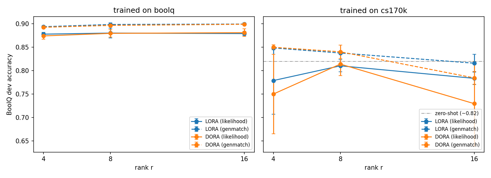
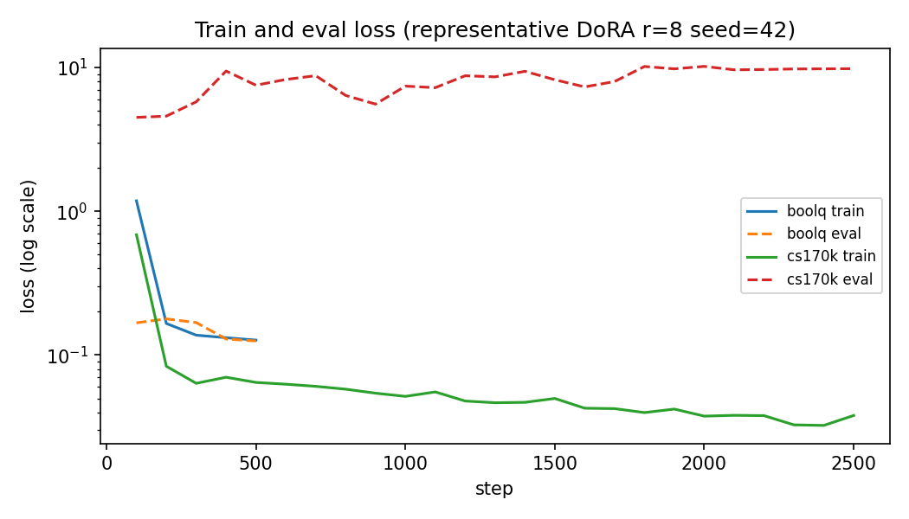
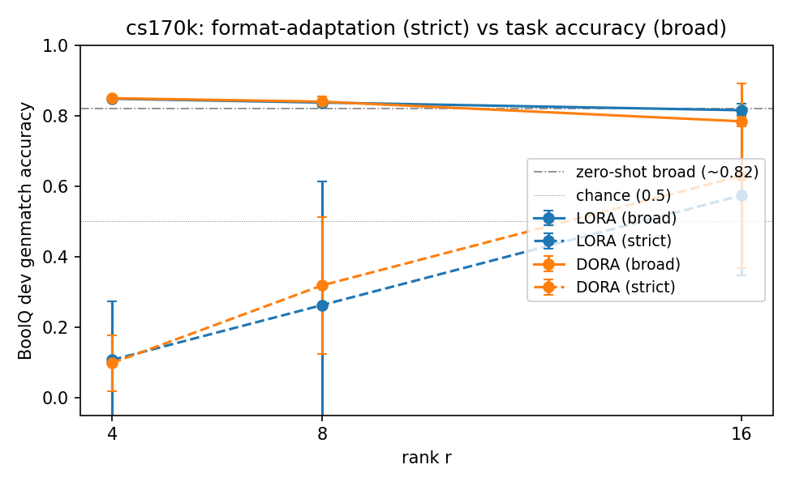
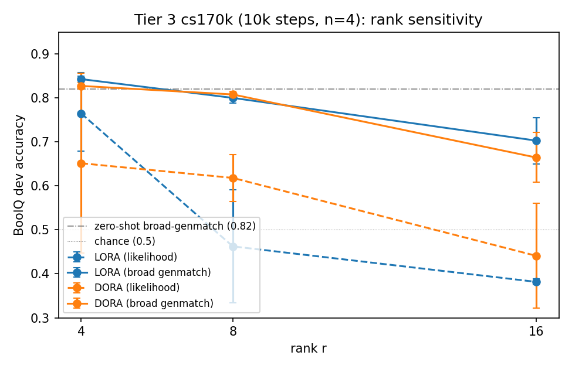
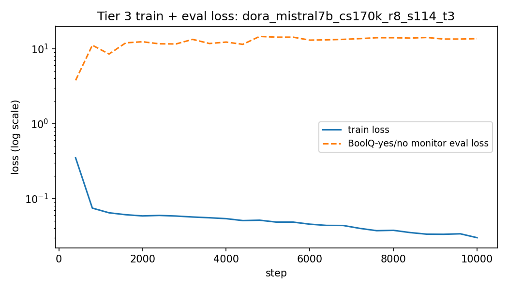
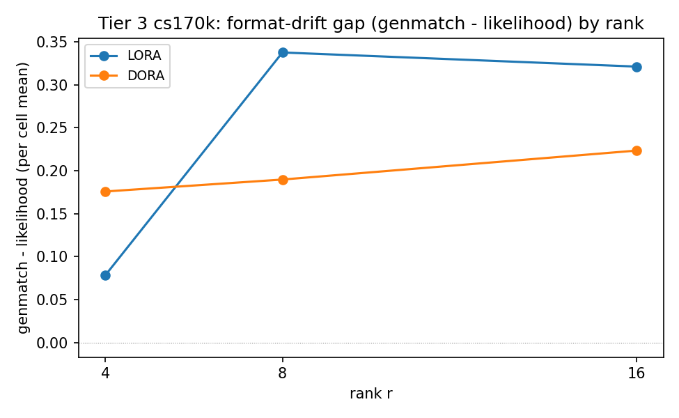

# Reproducing DoRA on Mistral-7B-Instruct-v0.3: Task Accuracy, Format Adaptation, and the Rank Trade-off

<!-- Main body (Part 6 mini-project). All sections drafted and audited. Figures live in ../../mini-project-DoRA/figures/. -->

## Abstract

Parameter-efficient fine-tuning (PEFT) adapts large language models by training a tiny fraction of their weights. Low-Rank Adaptation (LoRA) is the standard choice, but Weight-Decomposed Low-Rank Adaptation (DoRA; Liu et al., 2024) reports higher accuracy — with its largest gains at low rank — by splitting each weight into a magnitude and a direction and applying the low-rank update only to the direction. We test this claim as a generalization study: instead of the paper's raw LLaMA base, we adapt the instruction-tuned `Mistral-7B-Instruct-v0.3` on the per-task BoolQ benchmark and the multi-task commonsense-170k mixture, sweeping rank $r \in \{4, 8, 16\}$ against a matched LoRA baseline at a course-feasible 2,500-step budget (three seeds) and a 10,000-step extension (four fresh seeds).

Across 60 training runs on University of Melbourne Spartan H100 GPUs, DoRA does **not** improve task accuracy over LoRA at any rank. At mid rank ($r{=}8$) it instead better resists the format shift that multi-task training induces, retaining the original yes/no answer format where LoRA adopts the trained true/false (a $+0.16$ edge on the yes/no likelihood probe, outside seed noise). Quadrupling the budget sharpens an *inverse-rank* trend: low-rank adapters stay at or above the zero-shot baseline (generation exact-match, "genmatch", $0.82$) while high-rank adapters drift well below it (the within-method gap widening from $\sim 3$–$7$ to $\sim 14$–$16$ percentage points). A parser fix separating *task accuracy* from *format adaptation* proved essential, and DoRA's $\sim 3.3\times$ wall-time and $\sim 1.8\times$ peak-memory overhead is reconfirmed throughout. We conclude that DoRA's low-rank advantage surfaces here on a format-related axis rather than as accuracy — a conclusion tempered by the limited seed count, the sub-paper training budget, and the already-aligned instruction-tuned base.

## Introduction

Fine-tuning a 7-billion-parameter model the conventional way means updating every weight and storing optimizer state for each — tens of gigabytes of GPU memory and a fresh multi-gigabyte checkpoint per task. Parameter-efficient fine-tuning (PEFT) removes that barrier: LoRA freezes the pretrained weights and learns a small low-rank update $BA$ in their place, training under $0.1\%$ of the parameters and shipping a $\sim 30$ MiB adapter instead of a 14 GiB model. This makes per-task specialization cheap enough to run on a single GPU — but LoRA leaves a measurable accuracy gap below full fine-tuning, and that gap is widest exactly where we most want to save: at low rank. DoRA targets this gap directly. It decomposes each pretrained weight into a magnitude and a direction, applies the LoRA-style low-rank update only to the direction, and learns the magnitude as a separate parameter; the paper reports that this recovers much of the lost accuracy and that the advantage is *largest at low rank*, where parameter budget is tightest.

If that claim is robust, it is genuinely useful: it would mean cheaper, smaller adapters with less quality loss, directly improving how well large models can be specialized on constrained hardware. But a single paper's numbers, measured on one base model and one training budget, do not by themselves establish robustness — and the extra cost DoRA incurs ($\sim 3.3\times$ training time in our runs) only pays off if its accuracy advantage actually transfers. This project therefore tests the paper's central claim under deliberately different conditions: an instruction-tuned base model (`Mistral-7B-Instruct-v0.3`) rather than the paper's raw LLaMA, the same datasets the paper uses (BoolQ and commonsense-170k) but at a realistic course compute budget, and a controlled LoRA-versus-DoRA rank sweep with multiple seeds so we can tell a real effect from seed noise. The question we carry throughout is the paper's own: *does DoRA outperform LoRA more at low rank?* — and, where it does not, *what does the magnitude–direction decomposition change instead?*

## Problem description

**Objective and success criterion.** The goal is to test, not merely re-run, DoRA's headline result. Because we change the base model, the PEFT implementation (HuggingFace `peft` rather than the authors' custom fork), and the training budget, bit-identical numbers are neither expected nor the point. Success is answering a qualitative question with controlled evidence: *across a matched LoRA/DoRA rank sweep, does DoRA's reported low-rank accuracy advantage appear in our regime, and if not, what — if anything — does the decomposition measurably change?* Framing the study as a generalization test rather than a strict replication is what makes a null accuracy result informative rather than a failed reproduction.

**Model and data.** The base model is `Mistral-7B-Instruct-v0.3` (Jiang et al., 2023), a 7.25 B-parameter instruction-tuned model that is open-access and already part of the course toolchain. We adapt it in two regimes:

- **BoolQ** (Clark et al., 2019) — a binary yes/no reading-comprehension QA dataset, 9,427 training and 3,270 development examples. This is the *per-task* regime: the adapter sees only BoolQ.
- **commonsense-170k** (cs170k) — a 170,000-example mixture of eight commonsense-reasoning tasks (BoolQ among them), assembled by the LLM-Adapters project (Hu et al., 2023) and used by the DoRA paper. This is the *multi-task* regime, and the one the paper's low-rank claim is built on.

Both regimes are evaluated on the *same* full BoolQ development set (3,270 examples), so a single accuracy axis is comparable across them and against a zero-shot (no-adapter) baseline.

**Difficulties and obstacles.** Several constraints shaped the design and the interpretation:

1. **Compute and memory.** DoRA's decomposition roughly triples training wall-time and raises peak GPU memory to $\sim 60$ GB (versus $\sim 34$ GB for LoRA), so it will not fit on a 24 GB consumer card; all training ran on data-centre H100 80 GB GPUs (the Methods quantify the resulting GPU-hour cost).
2. **Training budget versus the paper.** The paper trains $\sim 32$k cs170k steps; a 2-method $\times$ 3-rank $\times$ 3-seed grid cannot match that on a course budget. We cap the core study at 2,500 steps (7.8% of the paper's — training loss converges by step $\sim 1{,}200$) and add a 10,000-step extension (31%) to probe how the conclusions move with budget.
3. **Statistical power.** Three seeds (core) and four (extension) are too few for formal significance, and seed variance is large on some metrics. We report mean $\pm$ std throughout and state explicitly when a gap sits within noise.
4. **Base-model mismatch (the key interpretive obstacle).** An instruction-tuned model is already format-stable and competent at BoolQ-style prompts, which suppresses precisely the format-collapse failure mode that the paper's low-rank DoRA advantage is most sensitive to. A null accuracy result therefore has to be read in light of a starting point that gives LoRA less room to fail.
5. **Metric ambiguity.** The BoolQ evaluation prompt asks for *yes/no*, but cs170k teaches the model to answer *true/false*. A naive exact-match parser that accepts only true/false scores a correct yes/no answer as wrong — silently conflating *task accuracy* (is the answer right?) with *format adaptation* (did the adapter adopt the training vocabulary?). Recognizing this and broadening the parser to accept either vocabulary was necessary to interpret the cs170k results at all, and the task-versus-format distinction becomes a central thread in the Methods and Results.

## Techniques and methods

### From LoRA to DoRA

Both methods adapt a frozen pretrained weight $W_0 \in \mathbb{R}^{d \times k}$ with a small trainable update. **LoRA** (Hu et al., 2021; developed in full in the Foundations section, Part 5) writes the adapted weight as
$$
W = W_0 + \frac{\alpha}{r}\, B A, \qquad B \in \mathbb{R}^{d \times r},\; A \in \mathbb{R}^{r \times k},\; r \ll \min(d, k),
$$
freezing $W_0$ and training only the rank-$r$ factors $A$ and $B$; the scalar $\alpha/r$ keeps the update's scale stable as $r$ varies. **DoRA** (Liu et al., 2024) keeps this low-rank update but first splits each weight into a *magnitude* and a *direction*. Writing $\lVert \cdot \rVert_c$ for the column-wise Euclidean norm, it reparameterizes the adapted weight as
$$
W' = m \, \frac{W_0 + B A}{\lVert W_0 + B A \rVert_c},
$$
where $m \in \mathbb{R}^{1 \times k}$ is a trainable magnitude vector (one entry per column) and $(W_0 + BA)$ is the LoRA-updated direction, renormalized to unit column-norm before $m$ rescales it. At initialization $m = \lVert W_0 \rVert_c$ and $BA = 0$, so $W' = W_0$ exactly — training starts from the pretrained model, as in LoRA. The motivation is that full fine-tuning tends to move a weight's magnitude and direction by different relative amounts, whereas LoRA's single additive term couples them; giving the magnitude its own parameter lets DoRA adjust scale and orientation independently, which the paper argues better mimics full fine-tuning and is most beneficial when the directional budget — the rank $r$ — is small.

For a fair comparison the two methods share an otherwise identical configuration: we use HuggingFace `peft`'s `LoraConfig` (Mangrulkar et al., 2022), and the *only* difference between a LoRA run and its DoRA counterpart is the `use_dora` flag. We deliberately use the library implementation rather than the authors' bundled fork — the question is whether a practitioner reaching for the standard tool sees the paper's advantage.

### Experimental design

The study is a controlled factorial sweep: 2 methods (LoRA, DoRA) $\times$ 3 ranks ($r \in \{4, 8, 16\}$) $\times$ multiple seeds $\times$ 2 training regimes, plus a zero-shot (no-adapter) baseline. The **core study** (Tier 2 in the figures) is 36 runs over three seeds $\{42, 1, 2\}$, spanning the per-task BoolQ regime and the multi-task cs170k regime. A sequential **budget extension** (Tier 3) adds 24 cs170k-only runs over four *fresh* seeds $\{114, 514, 1919, 810\}$ at four times the training length; the disjoint seed set makes it an independent replication rather than a re-aggregation of the core runs.

Across every run the adapter targets *all* linear layers (`target_modules: all-linear` — both the attention $q/k/v/o$ projections and the MLP gate/up/down projections), with $\alpha/r = 2$ (so $\alpha = 8, 16, 32$ for $r = 4, 8, 16$), LoRA dropout $0.05$, and bf16 weights. Training uses the HuggingFace `Trainer` (Wolf et al., 2020) with its default AdamW optimizer and a linear warmup-then-decay learning-rate schedule, an effective batch size of 16 (micro-batch 4 $\times$ gradient accumulation 4), and a 512-token cap. The per-regime settings are:

| Regime (tier) | Train set | Steps | Warmup | Learning rate |
|---|---|---:|---:|---:|
| BoolQ (core) | BoolQ train (9,427) | 500 | 50 | $5\times10^{-5}$ |
| cs170k (core) | commonsense-170k | 2,500 | 100 | $2\times10^{-4}$ |
| cs170k (extension) | commonsense-170k | 10,000 | 400 | $2\times10^{-4}$ |

The multi-task regime uses a learning rate four times higher than the per-task one, reflecting its larger, more heterogeneous mixture; it is also the regime in which the format-adaptation effects discussed in the Results arise, since cs170k trains the model toward a *true/false* answer format.

### Evaluation, and a necessary parser fix

Every adapter — whatever its training regime — is evaluated on the *same* full BoolQ development set (3,270 examples), giving one accuracy axis comparable across regimes and against the zero-shot baseline. We report two metrics:

- **Likelihood accuracy** compares the first-token log-probabilities the model assigns to "Yes" versus "No". It needs no text parsing and probes directly whether the model's internal distribution favours the correct answer.
- **Generation exact-match (genmatch)** greedily decodes a short answer, parses it, and exact-matches it to the gold label — the paper-style, user-facing metric.

The genmatch metric exposed a subtlety that became central to the analysis. The BoolQ evaluation prompt asks for *yes/no*, but the cs170k training data teaches *true/false*. A strict parser that accepts only true/false therefore scores a model answering "yes" correctly as *wrong*, conflating two different things: whether the answer is right (*task accuracy*) and whether the adapter has adopted the trained vocabulary (*format adaptation*). We resolve this by reporting genmatch under two parsers — a **broad** parser (`parse_yes_no_or_true_false`) that accepts either vocabulary normalized to the gold label, measuring task accuracy; and a **strict** parser (true/false only), which instead measures *how strongly* the adapter has overridden the prompt with the trained format. This task-versus-format split is the lens for the Results, and it becomes essential at the longer extension budget, where the model commits so fully to true/false that the yes/no likelihood probe collapses even while the model keeps answering correctly.

### Compute environment

Training ran on the University of Melbourne Spartan HPC `gpu-h100` (80 GB) partition (`torch 2.6.0+cu124`). DoRA's decomposition costs roughly $3.3\times$ the wall-time of LoRA at matched settings and peaks near 60 GB of GPU memory (versus $\sim 34$ GB for LoRA) at every rank, so DoRA training requires 80 GB-class hardware. The core sweep totals $\sim 25$ GPU-hours of training plus generation-eval; the budget extension adds $\sim 114$ GPU-hours. Each run records its full configuration and code commit alongside its metrics, which are aggregated into the summary tables reported next.

## Presentation and discussion of results

All adapters are scored on BoolQ-dev accuracy against the zero-shot baseline (likelihood $0.824$, broad-genmatch $0.820$). Headline DoRA−LoRA gaps are quoted inline; the full per-cell tables (12 core cells, 6 extension cells, and the DoRA−LoRA gap tables) are collected in the Appendix.

### Per-task BoolQ: both methods saturate, neither pulls ahead

**Figure 1.** BoolQ-dev accuracy versus rank for LoRA (blue) and DoRA (orange), solid = broad genmatch, dashed = likelihood. Left: trained on BoolQ. Right: trained on cs170k, with the zero-shot broad-genmatch baseline ($\approx 0.82$) marked.

On BoolQ, both methods lift the model from the $0.82$ baseline to $\sim 0.88$ likelihood and $\sim 0.89$–$0.90$ genmatch, essentially flat across rank (Figure 1, left). The two are indistinguishable: the DoRA−LoRA genmatch gap is $\le 0.002$ at every rank, well inside seed variation. The per-task regime is easy enough that a rank-4 adapter already saturates it, leaving no headroom for DoRA's decomposition to exploit — a first null for the paper's low-rank-advantage claim.

**Figure 2.** Train/eval loss (log scale) for a representative run. BoolQ losses settle within a few hundred steps; the cs170k *eval* loss (red) rises toward $\sim 10$ even as cs170k *train* loss falls — the first sign of the format mismatch discussed below.

The loss curves (Figure 2) show both regimes converge quickly in training, but the cs170k eval loss — measured on the BoolQ yes/no prompt — *rises* toward $\sim 10$ while its training loss collapses. A cs170k-trained model is answering well but in the "wrong" vocabulary for the yes/no eval, which is exactly the effect the next section makes precise.

### Multi-task cs170k: an inverse-rank trend, and two views of "accuracy"

Training on the 8-task cs170k mixture is more revealing (Figure 1, right). On task accuracy (broad genmatch), a low-rank adapter *beats* the zero-shot baseline (r=4: $\sim 0.85$), while a high-rank one falls *below* it (r=16: $0.82$ LoRA / $0.78$ DoRA) — an **inverse-rank trend**, opposite to "more capacity is better." It is only a few points wide here and within seed scatter at $n=3$ — it firms up at the larger budget below. The reading: cs170k specializes the model *away* from pure BoolQ; at low rank that drift is mild and the model keeps its BoolQ ability, while at high rank the adapter commits harder to the broader mixture at BoolQ's expense. DoRA shows no accuracy advantage here either — within seed std at r=4 and r=8, and at r=16 DoRA is in fact slightly *behind* ($-0.03$, the one direction-consistent gap across all three seeds, still $n=3$).

The strict-vs-broad parser split (Methods) turns this into a clean story (Figure 3). Broad genmatch (task accuracy) stays flat near $0.82$ across rank, but strict genmatch — which counts an answer only if phrased as *true/false* — climbs steeply, from $\sim 0.10$ at r=4 to $\sim 0.57$ (LoRA) / $\sim 0.63$ (DoRA) at r=16. The model answers correctly at every rank (flat broad line); only at higher rank does it adopt the cs170k *true/false* format (rising strict line). The widening gap *is* the format-adaptation signal. This is also where DoRA shows its only hint of the paper's effect — a $+0.056$ strict-genmatch edge at r=8 and r=16 — but with seed std of $0.16$–$0.35$ and the per-seed direction split, it is a hint, not significance.

**Figure 3.** cs170k, by rank: broad genmatch (solid, task accuracy) stays flat near the 0.82 baseline, while strict genmatch (dashed, format-adaptation strength) climbs with rank — higher-rank adapters lock in the trained true/false format.

### Scaling the budget (Tier 3): the trends sharpen, and DoRA's real difference appears

Quadrupling the cs170k budget to 10k steps (four fresh seeds) sharpens both findings. The inverse-rank trend widens from $\sim 3$–$7$ percentage points (pp; 3.3 pp LoRA, 6.6 pp DoRA) to $\sim 14$ pp (LoRA) / $\sim 16$ pp (DoRA) within-method (Figure 4): r=4 still sits at or above baseline ($0.84$/$0.83$) while r=16 drops to $0.70$/$0.66$. More training simply lets higher-rank adapters commit harder to the multi-task distribution and sacrifice more BoolQ-specific accuracy — a roughly $2$–$4\times$ amplification of the Tier-2 signal ($\approx 4\times$ for LoRA, $\approx 2.5\times$ for DoRA).

**Figure 4.** Tier-3 cs170k (10k steps, n=4). Broad genmatch (solid) shows the sharpened inverse-rank trend; likelihood (dashed) collapses much further — see text.

At this budget the two-views distinction becomes essential, not optional. Read by the yes/no *likelihood* probe alone, Tier 3 looks catastrophic — the mid- and high-rank cells fall by $0.20$–$0.40$ versus Tier 2 (e.g. LoRA r=8: $0.81 \to 0.46$). But broad genmatch shows only mild task-accuracy loss ($\le 0.12$). The model is not broken; it has *fully* switched to true/false, so the yes/no probe misreads a correct answer as wrong. Figure 5 makes this concrete: training loss converges to $\sim 0.03$ while the BoolQ-yes/no monitor loss climbs past $10$. **At Tier 3, genmatch is the task-accuracy metric and likelihood is a format-preservation probe.**

Read that way, DoRA's one robust difference from LoRA finally appears — and it is *not* accuracy. At r=8, DoRA's likelihood is $0.62$ versus LoRA's $0.46$, a $+0.16$ edge outside DoRA's seed std ($\sim 0.05$), with three of four paired seeds favouring DoRA — while the matching genmatch gap is $\sim 0$. DoRA and LoRA reach the *same* answers, but DoRA's magnitude–direction decomposition resists the cs170k format takeover where LoRA capitulates. Figure 6 shows this directly as the genmatch$-$likelihood gap: LoRA's jumps to $\sim 0.34$ at r=8 (format collapse), DoRA's stays near $0.19$. It is tempting to read this as the sharper, $n=4$ version of the Tier-2 strict-parser hint, but the two point in *opposite* directions. At Tier 2, DoRA leaned slightly *toward* the trained true/false format (more adaptation, within noise); at Tier 3 it instead *held onto* the original yes/no format (more preservation, outside seed std). What is consistent — and all we claim — is that **DoRA's only measurable edge over LoRA is on a format-related axis, not task accuracy**; we do not posit a single mechanism across the two budgets, and the Tier-3 likelihood edge is the statistically cleaner of the two. This is a dimension the project's stated BoolQ-accuracy metric was never designed to surface.

**Figure 5.** A representative 10k-step run: train loss falls to $\sim 0.03$ while the BoolQ-yes/no monitor eval loss climbs past 10 — the model has fully committed to the trained format, which is why the likelihood probe (but not genmatch) collapses.

**Figure 6.** Tier-3 format-drift gap (genmatch − likelihood) per cell. A larger gap means the likelihood probe has collapsed (format takeover). LoRA's gap spikes at r=8; DoRA's stays lower — DoRA preserves the yes/no format better at mid rank.

### Cost

DoRA's overhead is the most robust quantitative result of the study: $\sim 3.3\times$ wall-time and $\sim 1.8\times$ peak memory versus LoRA, stable across every rank, regime, and budget (at 10k steps, $\sim 5.3$ h vs $\sim 1.6$ h per run; $\sim 60$ GB vs $\sim 34$ GB peak). Tellingly, this is *not* a parameter-count cost: DoRA adds only the magnitude vector — $+6.6\%$ trainable parameters at $r{=}8$ (22.35 M vs LoRA's 20.97 M) — so the overhead comes from the per-step column-wise renormalization the decomposition requires, not from a larger adapter. Whatever DoRA buys here — format robustness at mid rank, not accuracy — it buys at roughly triple the training cost.

## Conclusion

We set out to test DoRA's central claim — that its magnitude–direction decomposition beats LoRA, most of all at low rank — by transferring it from the paper's raw-LLaMA setting to an instruction-tuned Mistral-7B, across a per-task and a multi-task regime, two training budgets, and a controlled rank sweep. The claim **does not replicate as a task-accuracy advantage**: at no rank, regime, or budget does DoRA beat LoRA on BoolQ accuracy beyond seed noise. What the decomposition does change is **format robustness** — at mid rank (r=8, 10k steps) DoRA resists the cs170k format takeover better than LoRA ($+0.16$ on the likelihood probe with the genmatch gap at zero), a difference only visible once task accuracy and format adaptation are separated (a weaker, opposite-pointing Tier-2 hint stayed within noise, so we claim a format-related effect, not a single mechanism). Along the way the multi-task regime revealed an **inverse-rank generalization trend** — low-rank adapters stay at or above the zero-shot baseline while high-rank adapters drift below it — that sharpens by roughly $2$–$4\times$ with training budget. All of this comes at DoRA's reconfirmed $\sim 3.3\times$ time and $\sim 1.8\times$ memory cost.

**Limitations.** The strongest caveats bear directly on the headline null:

- **Statistical power.** Three and four seeds are too few for significance, and the format metrics carry large seed variance ($0.16$–$0.35$); the DoRA strict-genmatch edge stays within that noise. Our claims are therefore "no advantage *observed*," not "no advantage *exists*."
- **Training budget.** At 2,500 and 10,000 steps we reach 7.8% and 31% of the paper's $\sim 32$k-step budget. Training loss converges early, but the format dynamics are still evolving at 10k; a paper-faithful budget could plausibly push the mid-rank DoRA edge to significance.
- **Base-model mismatch.** This is the most likely reason our accuracy result diverges from the paper. An instruction-tuned model is already format-stable and competent at BoolQ, suppressing exactly the format-collapse failure mode the paper's low-rank DoRA advantage is most sensitive to — so LoRA simply has less room to fail here.
- **Metric coupling.** The yes/no likelihood probe stops measuring task accuracy once the model adopts true/false, and the strict-parser numbers are a one-way snapshot. We mitigated both with the broad-parser genmatch, but a parser-independent multi-task metric would be cleaner.
- **Hardware reach.** DoRA's $\sim 60$ GB peak confines it to 80 GB-class data-centre GPUs, limiting who can use it at all.

**Extensions.** With more time, the natural next steps are: (i) a paper-faithful $\sim 32$k-step budget with $n \ge 5$ seeds, to settle whether the format-preservation edge — and any low-rank accuracy gain — crosses significance; (ii) repeating the sweep on the paper's raw LLaMA base, to directly test the "instruction-tuned base suppresses the effect" hypothesis that best explains our null; (iii) evaluating on the *full* cs170k task suite with per-task metrics, so "accuracy" reflects the multi-task objective the adapter actually optimizes rather than BoolQ alone; and (iv) inspecting the DoRA-specific magnitude vector $m$ directly, to understand the mechanism behind its mid-rank format robustness. The broader lesson is methodological: when a method's claimed benefit is measured by generation exact-match, separating *task accuracy* from *format adaptation* is not optional — it is what turned a confusing set of numbers into a coherent, and honest, result.

<!-- References are compiled in references.md, assembled after the Appendix. -->
